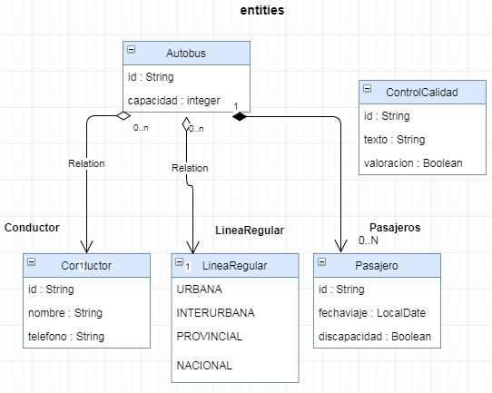
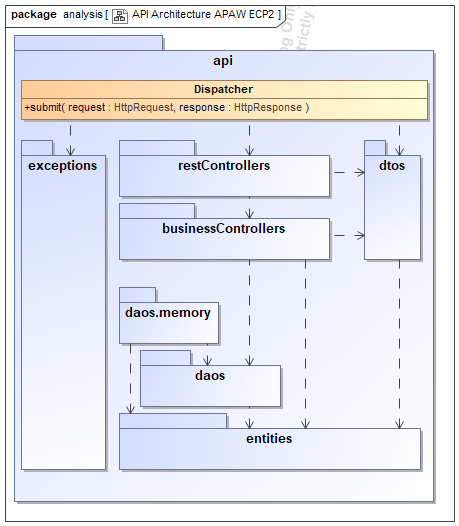

# Arquitectura de un mini API-Rest simulado
> Este proyecto pretende ser un ejemplo sencillo de arquitectura de un API-Rest simulado para comprender las capas que intervienen y la organización de los diferentes tipos de test, con integración continua y control de la calidad del código
> #### [Máster en Ingeniería Web por la Universidad Politécnica de Madrid (miw-upm)](http://miw.etsisi.upm.es)
> #### Asignatura: *Arquitectura y Patrones para Aplicaciones Web*

## Tecnologías necesarias
* Java
* Maven
* GitHub

## Diseño de entidades

## Arquitectura

### Responsabilidades
#### Dispatcher
* Centraliza las peticiones y hace de repartidor
* Recupera los datos de la petición y los pasa como parámetros de método
* Captura las excepciones y las convierte en errores Http
#### restControllers
* Define el path del recurso
* Valida la entrada
* Traspasa la petición a los controladores de la capa de negocio
#### businessControllers
* Procesa la petición, apoyándose en los DAO’s
* Crea las entidades a partir de los DTO’s
* Gestiona la respuesta a partir de las entidades. Delega en los DTO’s la creación a partir de la entidad
#### daos
* Gestionan la BD
#### entities
* Son las entidades persistentes en la BD

## API
### POST /Conductor
#### Parámetros del cuerpo
###### issue#1
- `id`: String (**requerido**)
- `nombre`: String
- `telefono`: String
#### Respuesta
- 200 OK 
  - `id`: String
- 403 BAD_REQUEST
---
### POST /ControlCalidad
#### Parámetros del cuerpo
###### issue#2
- `id`: String (**requerido**)
- `texto`: String
- `valoracion`: Boolean
#### Respuesta
- 200 OK 
  - `id`: String
- 403 BAD_REQUEST
---
### POST /Autobus
###### issue#3
#### Parámetros del cuerpo
- `id`: String (**requerido**)
- `capacidad`: integer
- `conductorId`: String (**requerido**)
#### Respuesta
- 200 OK 
  - `id`: String
- 403 BAD_REQUEST
- 404 NOT_FOUND
---
### PUT /ControlCalidad/{id}
###### issue#4
#### Parámetros del cuerpo
- `id`: String (**requerido**)
- `texto`: String
- `valoracion`: Boolean
#### Respuesta
- 200 OK 
- 403 BAD_REQUEST
- 404 NOT_FOUND
--- 
### GET /ControlCalidad
###### issue#6
#### Respuesta
- 200 OK 
  - `[ {id:String,texto:String,valoracion:Boolean} ]`
---
### PATH /Autobus/{id}/LineaRegular
###### issue#7
#### Parámetros del cuerpo
- `lineaRegular`: String (**requerido**)
#### Respuesta
- 200 OK 
- 403 BAD_REQUEST
- 404 NOT_FOUND
---
### DELETE /Conductor/{id}
###### issue#8
#### Respuesta
- 200 OK 
---
### GET /Autobus/search?q=average:>=10
#### Respuesta
- 200 OK
  - `[ {id:String,reference:String} ]`
- 403 BAD_REQUEST
---

##### Autor Alumno: Torrecilla Sánchez, Agustin
